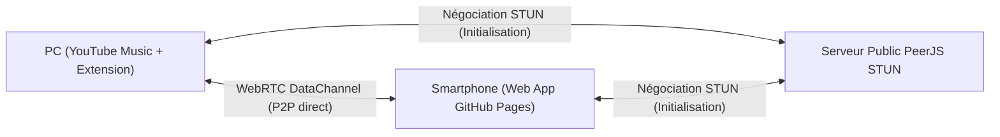

# 🎵 YouTube Music Player & Remote P2P

> **L'extension ultime et universelle pour YouTube Music** : Mini-Player Picture-in-Picture Always-on-Top, paroles synchronisées style Apple Music (BetterLyrics), et télécommande smartphone temps réel **100 % Plug & Play** (WebRTC P2P, zéro configuration, zéro Python).

---

## ⚡ Installation Rapide (En 1 minute chrono)

### 📥 Étape 1 : Télécharger l'extension

Choisissez l'archive correspondant à votre navigateur :

- 🔵 **[Télécharger pour Google Chrome, Brave, Edge, Opera (youtube_music_player_chrome.zip)](https://github.com/Nael-Basset/ytm-remote/releases/latest/download/youtube_music_player_chrome.zip)**
- 🦊 **[Télécharger pour Mozilla Firefox (youtube_music_player_firefox.zip)](https://github.com/Nael-Basset/ytm-remote/releases/latest/download/youtube_music_player_firefox.zip)**

Une fois le fichier `.zip` téléchargé sur votre ordinateur, **décompressez-le** (clic droit ➔ *Extraire tout*).

---

### 🌐 Étape 2 : L'installer dans votre navigateur

Choisissez votre navigateur ci-dessous :

#### 🔵 Google Chrome, Brave, Microsoft Edge, Opera, Vivaldi (Navigateurs Chromium)

1. Ouvrez la page de gestion des extensions dans votre navigateur :
   - **Google Chrome** : tapez `chrome://extensions` dans la barre d'adresse.
   - **Brave** : tapez `brave://extensions`.
   - **Microsoft Edge** : tapez `edge://extensions`.
   - **Opera** : tapez `opera://extensions`.
2. Activez le bouton **Mode développeur** en haut à droite de l'écran.
3. Cliquez sur le bouton **Charger l'extension non empaquetée** *(Load unpacked)* en haut à gauche.
4. Sélectionnez le dossier décompressé contenant les fichiers de l'extension.
5. C'est tout ! L'extension est installée et active.

#### 🦊 Mozilla Firefox

1. Ouvrez un onglet et tapez `about:debugging#/runtime/this-firefox` dans la barre d'adresse.
2. Cliquez sur le bouton **Charger un module temporaire...**.
3. Sélectionnez le fichier `manifest.json` situé à l'intérieur du dossier décompressé de l'extension.
4. C'est prêt !

---

### 🎧 Étape 3 : Utilisation

1. Rendez-vous sur **[music.youtube.com](https://music.youtube.com)** (rafraîchissez la page si elle était déjà ouverte).
2. Deux nouvelles icônes apparaissent directement dans la barre de contrôle en bas à droite :
   - 🖼️ **Mini-Player PiP** : Ouvre un lecteur flottant Always-on-Top ultra-compact avec paroles et contrôles complets.
   - 📱 **Télécommande Smartphone** : Affiche instantanément un QR Code.
3. **Scannez le QR Code avec l'appareil photo de votre smartphone** :
   - L'application web mobile [https://nael-basset.github.io/ytm-remote/](https://nael-basset.github.io/ytm-remote/) s'ouvre automatiquement.
   - Votre smartphone se connecte **en moins de 100 ms en direct (P2P)** à votre PC, sans aucun compte ni installation sur votre téléphone !

---

## ✨ Fonctionnalités Principales

| Fonctionnalité | Description |
| :--- | :--- |
| **📱 Télécommande WebRTC P2P** | Contrôlez la musique depuis votre canapé ou votre lit. Fonctionne en Wi-Fi local comme en 4G / 5G. |
| **👥 Multi-appareils en simultané** | Plusieurs smartphones ou tablettes peuvent être connectés en même temps pour gérer la musique à plusieurs. |
| **🎤 Paroles Mot par Mot (BetterLyrics)** | Les mots s'illuminent au rythme exact où ils sont chantés (sans grossissement intempestif pour une lisibilité parfaite). Mode plein écran immersif inclus. |
| **🎶 File d'attente complète ("À suivre")** | Affiche tous les morceaux à venir avec leurs pochettes d'album haute qualité (sans blocage après le 14ᵉ morceau). Cliquez sur n'importe quel titre pour le lancer. |
| **🔁 Répétition à 3 États** | Basculez d'un clic entre **Désactivé (0)**, **Répéter toute la playlist (1)** et **Répéter le morceau en cours (2)**. |
| **🎛️ Commandes complètes** | Lecture, Pause, Suivant, Précédent, Barre de progression fluide, Contrôle du volume, Like, Dislike, Mode Aléatoire (Shuffle). |
| **⌨️ Raccourcis Clavier Globaux** | Contrôlez YouTube Music en jeu ou dans n'importe quel logiciel grâce aux touches de raccourci paramétrables. |
| **🔒 100 % Respectueux de la vie privée** | Aucune donnée collectée, aucun compte requis, communication P2P chiffrée de bout en bout. |

---

## 🏗️ Comment ça fonctionne ?

1. **Extension PC** : Héberge un nœud WebRTC sécurisé directement dans l'onglet YouTube Music.
2. **Web App Mobile** : Hébergée sur GitHub Pages, elle se connecte directement à votre PC via un canal de données sécurisé dès le scan du QR Code.
3. **P2P direct** : Zéro latence, zéro intermédiaire, zéro serveur tiers.

---

## 📄 Licence

Ce projet est sous licence libre [MIT](LICENSE).
