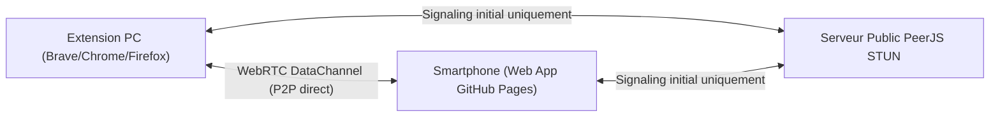

# 📱 YouTube Music Remote (P2P WebRTC)

Application web mobile autonome et universelle permettant de contrôler **YouTube Music** à distance depuis n'importe quel smartphone, tablette ou navigateur, **sans aucune installation logicielle** sur le PC hôte (Zéro Python, Zéro serveur local, Zéro configuration).

---

## ✨ Fonctionnalités

- **⚡ 100 % Plug & Play Universel** : Connexion instantanée (< 100 ms) via scan de QR Code ou lien de salle (`#ytm-xxxx`).
- **🌐 Communication WebRTC P2P directe** : Connexion poste-à-poste sécurisée et chiffrée entre votre smartphone et votre navigateur PC grâce à WebRTC DataChannels (PeerJS).
- **📶 Fonctionne partout** : Compatible que votre téléphone soit sur le même réseau Wi-Fi local ou en données mobiles (4G / 5G).
- **👥 Multi-appareils simultanés** : Plusieurs smartphones ou tablettes peuvent être connectés en même temps pour contrôler la musique à plusieurs.
- **🎨 Interface Apple Music Dark Mode** : Fond dynamique flouté réagissant à la pochette d'album en temps réel, animations fluides et retour haptique (vibrations).
- **🎤 Paroles Synchronisées (Apple Music Style)** :
  - Défilement automatique ligne par ligne synchronisé avec le lecteur.
  - Clic direct sur une phrase pour sauter immédiatement à ce moment du morceau.
  - Mode Plein Écran immersif avec mini-contrôles au pouce.
  - Support de la recherche multi-niveaux LRCLIB et des balises `[offset]`.
- **🎶 File d'attente complète ("À suivre")** :
  - Affichage de l'ensemble des titres de la playlist avec miniatures haute qualité.
  - Lancement instantané d'un morceau de la file en un clic.
- **🎛️ Contrôles complets du lecteur** :
  - Lecture / Pause, Morceau suivant, Morceau précédent.
  - Barre de progression interactive (Seek).
  - Contrôle du volume en temps réel.
  - Répétition à 3 états réels : Désactivé (0) ➔ Tout répéter (1) ➔ Répéter le titre (2).
  - Boutons Like, Dislike et Aléatoire (Shuffle).

---

## 🏗️ Architecture

1. **PC (Hôte)** : L'extension injectée dans `music.youtube.com` ouvre une salle WebRTC sécurisée identifiée par un code unique de session.
2. **Smartphone (Client)** : En scannant le QR Code affiché sur le PC (ou dans le mini-lecteur PiP), le téléphone charge l'application web hébergée sur GitHub Pages et rejoint la salle WebRTC.
3. **P2P direct** : Une fois la négociation initiale terminée via STUN, les paquets d'état et les commandes transitent en direct en peer-to-peer sans transiter par aucun serveur tiers.

---

## 🔒 Confidentialité & Sécurité

- Aucun compte requis.
- Aucune donnée personnelle, identifiant ou historique d'écoute n'est collecté ou enregistré.
- Connexion chiffrée de bout en bout (DTLS / SCTP) par le standard WebRTC.

---

## 📄 Licence

Ce projet est sous licence [MIT](LICENSE).
